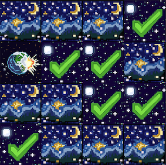

## This is a Simple Card Flipping Memory Game

### Instructions:
- There are 16 cards, which contain 8 pairs of matching images.
- The goal is to select the matching pairs in sequence.
- Click on a card to flip and view it. This is your first card.
- Click on a second card to compare it to the first card.
- If the correct card was picked, both cards will turn into ✅.
- If an incorrect card was picked, the cards will remain face down.
- Again, select a first card, and its corresponding second card.
- Repeat until all cards are matched.

### Installation and setup:
- Download the folder from github
- Open index.html with a web browser (Preferrably Google Chrome)

### Features Todo list:
- Add difficulty settings to reduce the time for which cards are shown
- Add a way to tell user whether first or second card of pair is being picked (grey out first card)
- Beautify and decorate
- Completion screen after game is done
- Add a click counter, with high score list
- Make mouse pointer change to the hand with finger when hovering over clickable image